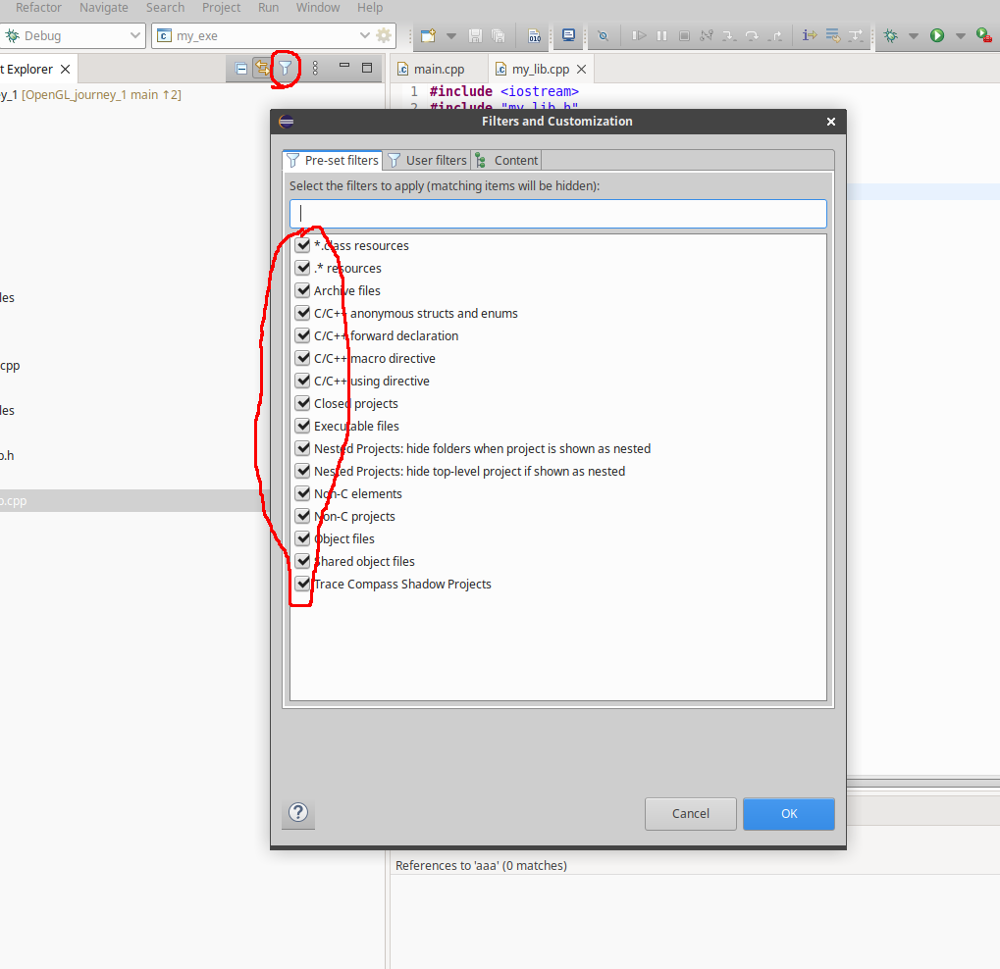
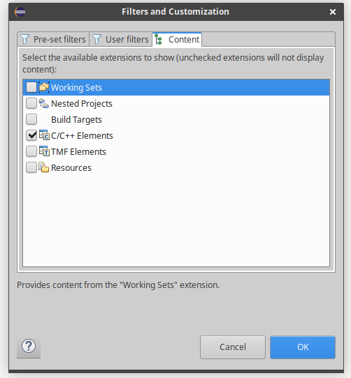
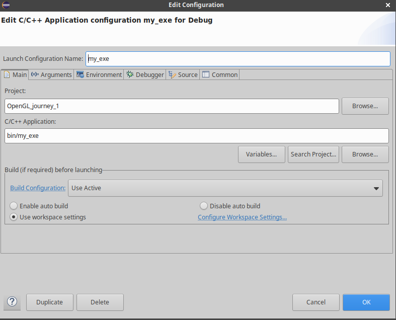

# OpenGL Journey - 1

## Build

```bash

# clean & build
$ cmake . && cmake --build . --clean-first

# run
$ ./bin/my_exe

```

## Generate eclipse project

```bash

# for linux
$ cmake -G "Eclipse CDT4 - Unix Makefiles" -DCMAKE_BUILD_TYPE=Debug ..

# for windows
$ cmake -G "Eclipse CDT4 - MinGW Makefiles" -DCMAKE_BUILD_TYPE=Debug ..

```

## IDEA - Eclipse

**Should be installed eclipse for C/C++ development**
- 
**Uncheck all except C/C++**
- 
**Import, existing projects into workspace**
**Debug configuration** `./bin/my_exe` path to binary
- 


## Eclipse - shortcuts
- Ctrl + Shift + R (on Windows and Linux) or Cmd + Shift + R (on Mac) to search for a file by name.
- Ctrl + Shift + T (on Windows and Linux) or Cmd + Shift + T (on Mac) to search for a type or class by name.
- F6 - Debug: step over
- F8 - Debug: resume